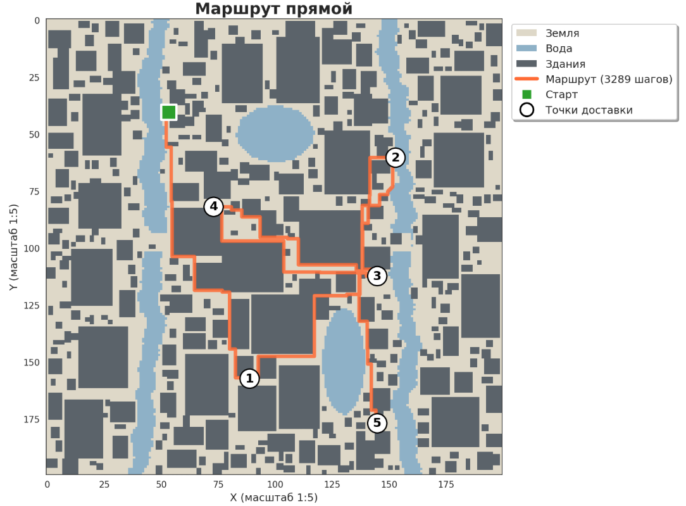
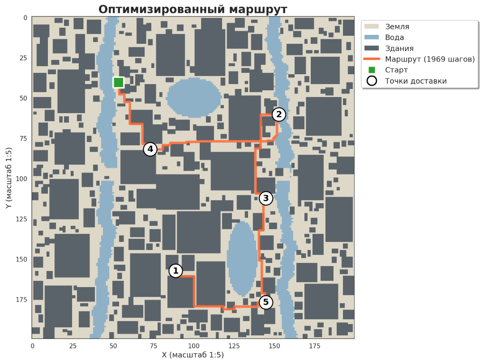

# courier_route

> Система оптимизации курьерских маршрутов с использованием алгоритмов на графах
>
> 📓 **[Основной ноутбук](courier-navigator.ipynb)** | 📦 **[Зависимости](requirements.txt)**

## 🎯 Что решает проект

Задача поиска оптимального маршрута для курьерской доставки: как посетить N точек 
доставки с минимальным пробегом, учитывая городские препятствия

## 🔧 Реализованные алгоритмы

- **BFS (Breadth-First Search)** — поиск кратчайшего пути между точками
- **Greedy Nearest Neighbor** — жадная оптимизация порядка посещения
- **Procedural Map Generation** — генерация городской карты с препятствиями

## 📊 Результаты

Жадный алгоритм сокращает длину маршрута на **20-50%** по сравнению 
с прямым порядком посещения рандомных точек

## 📸 Пример реализации

  
  

  <em>Слева: маршрут по порядку заказов | Справа: оптимизированный маршрут</em>

